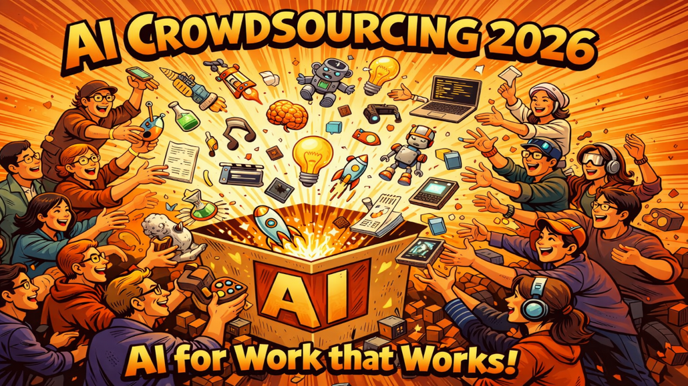

# AI Crowdsourcing 2026 – Gemeinsam die wirklich nützlichen KI-Anwendungen finden!

Im Vorfeld der lernOS Convention wollen wir gemeinsam mit euch herausfinden, was in der Praxis wirklich, wirklich funktioniert. Unter unserem Motto **„AI for Work that Works!“** laden wir Euch ein, Teil dieser Recherche zu werden – und zwar ganz konkret: durch Euren Input!

**Denn seien wir ehrlich:** Die Versprechungen der Tool-Anbieter klingen oft verlockend. Flüge buchen, Restaurants reservieren, E-Mails vollautomatisch beantworten – in der Realität sieht das häufig anders aus. Wer hat schon eine PowerPoint-Präsentation mit KI erstellt, die wirklich überzeugt hat? Wer lässt tatsächlich seine Inbox von einem Copiloten verwalten?

**Genau deshalb brauchen wir Eure Erfahrungen aus der Praxis.**

## Was wir vorhaben: Das AI Crowdsourcing 2026

Die Idee ist einfach:

- **Ihr reicht Eure KI-Anwendungsfälle ein**, die in Eurem Arbeitsalltag tatsächlich funktionieren.
- **Wir sammeln alle Vorschläge** in einer Online-Tabelle.
- **Nach der Sammelphase** veröffentlichen wir die Tabelle und jede:r kann die Beispiele ausprobieren und mit einem 5-Sterne-System bewerten.
- **Die Rangliste der besten Use Cases** präsentieren wir auf der lernOS Convention.

So entsteht eine praxiserprobte Sammlung von KI-Anwendungen – nicht aus Marketingfolien, sondern aus echten Erfahrungen von echten Menschen.

## Warum Eure Teilnahme wichtig ist

Die aktuelle Studienlage zu KI-Produktivitätsgewinnen ist gemischt. Manche Untersuchungen zeigen beeindruckende Effizienzsteigerungen, andere relativieren die Effekte stark – je nach Kontext, Aufgabe und Vorerfahrung. Was fehlt, ist ein **ehrlicher Blick auf konkrete Anwendungsfälle** aus dem deutschsprachigen Raum.

Mit Eurem Beitrag helft Ihr nicht nur der Community, sondern auch Euch selbst: Die gesammelten **Use Cases werden transparent dokumentiert** und stehen allen zur Verfügung. So könnt Ihr von den Erfahrungen anderer profitieren – und vielleicht den einen Tipp entdecken, der Eure Arbeit wirklich verändert.

## Was wir suchen

Wir suchen **konkrete KI-Anwendungsfälle**, die folgende Kriterien erfüllen:

1. **Praxiserprobt:** Du hast den Use Case selbst ausprobiert oder setzt ihn regelmäßig ein.
1. **Nachvollziehbar:** Andere können das Beispiel mit ähnlichen Tools nachbauen.
1. **Nützlich:** Der Anwendungsfall spart Zeit, verbessert Qualität steigert Kreativität oder erleichtert die Arbeit spürbar.

Dabei ist es egal, ob Ihr mit ChatGPT, Microsoft Copilot, Claude, Gemini oder einem anderen Tool arbeitet. Wichtig ist, dass es **für Euch funktioniert**.

## Jetzt mitmachen!

Die Teilnahme dauert nur wenige Minuten. Über unser Eingabeformular könnt Ihr Eure Use Cases direkt einreichen (bei mehreren Anwendungsbeispielen mehrfach ausfüllen):

➡️ [LINK ZUM FORMULAR](https://cloud.seatable.io/dtable/forms/f6d27a01-44ab-4bcd-97a6-81cda4a32b07/)

Die **Sammelphase läuft bis 31. Mai 2026**. Danach starten wir die Bewertungsphase und ihr könnt Eure Favoriten wählen.