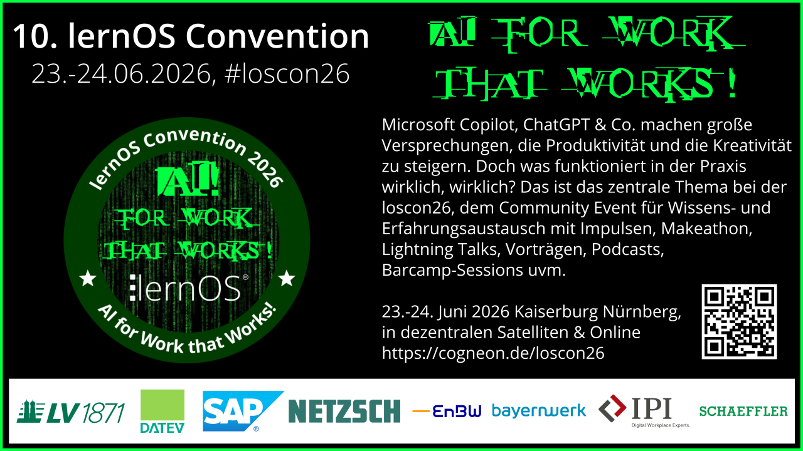

# Design

## Farben und Fonts
- **Farbe Grün dunkel:** #003B00
- **Farbe Grün mittel:** #008F11
- **Farbe Grün hell:** #00FF41
- **Font:** [Miltown](https://www.dafont.com/miltown.font)

## Key Visual

Download: [svg](./img/loscon26-key-visual.svg)

## Musik
tbd.

## Bildschirm-Hintergrund-Bild 

