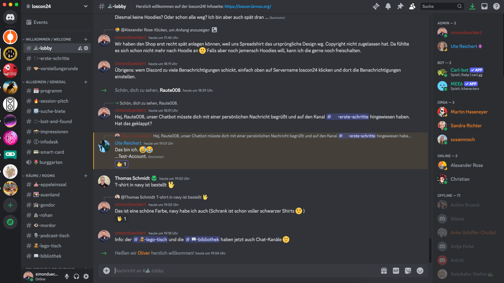

# Discord

Alle Teilnehmer:innen werden auf den loscon Discord-Server eingeladen. Dort findet ihr z.B. die Einwahllinks für das Programm, den virtuellen Infodesk, die Chats zu den Breakout-Räumen (2nd-Screen-Ansatz: Chat in Teams ist deaktiviert) und viel Raum für den hybriden Austausch. Ihr könnt Discord im Browser oder als Desktop- bzw. Mobil-App nutzen. Weitere Informationen zu Discord findet ihr im [Discord Hilfecenter](https://support.discord.com/hc/de).

Diese Kategorien (fett) und Kanäle haben wir im Server angelegt:

| Kategorie                    | Beschreibung                                                                                                                                                                                                                                                      |
| ---------------------------- | ----------------------------------------------------------------------------------------------------------------------------------------------------------------------------------------------------------------------------------------------------------------- |
| **Willkommen**               |                                                                                                                                                                                                                                                                   |
| lobby                        | Hier kommen alle an, ein Ort für ungezwungene Gespräche                                                                                                                                                                                                           |
| erste-schritte *(read only)* | Die wichtigsten Tipps für Discord-Newbies und der Link zur [Discord Hilfe](https://support.discord.com/hc/de)                                                                                                                                                     |
| vorstellungsrunde            | Hier könnt ihr Euch mit Name, Organisation, Bild, Hashtags, Links vorstellen. Im Kanal ist die das automatisch generierte Soziale-Netzwerk-Diagramm angepinnt.                                                                                                    |
|                              |                                                                                                                                                                                                                                                                   |
| **Allgemein**                |                                                                                                                                                                                                                                                                   |
| programm *(read-only)*       | Links zum [Programm](https://pretalx.com/loscon25/schedule/) und Teams-Einwahllinks für alle Räume                                                                                                                                                                |
| suche-biete                  | Alles, was ihr sucht oder bietet (Mitfahrgelegenheit, Hilfe, Dienstleistung etc.)                                                                                                                                                                                 |
| lost-and-found               | Wenn was liegen bleibt oder gefunden wird, hier posten                                                                                                                                                                                                            |
| impressionen                 | Hier könnt ihr Schöne Bilder/Videos von der Veranstaltung teilen                                                                                                                                                                                                  |
| infodesk                     | Anlaufstelle bei allen Fragen, die in der [FAQ](faq.md) nicht beantwortet werden                                                                                                                                                                                  |
|                              |                                                                                                                                                                                                                                                                   |
| **Räume**                    | Chat-Kanäle für Bühne und Breakout-Räume                                                                                                                                                                                                                                                                   |
|                              |                                                                                                                                                                                                                                                                   |
| **Satelliten**               | Chat-Kanäle für die [loscon Satelliten](https://loscon.lernos.org/de/loscon-everywhere/)                                                                                                                                                                          |