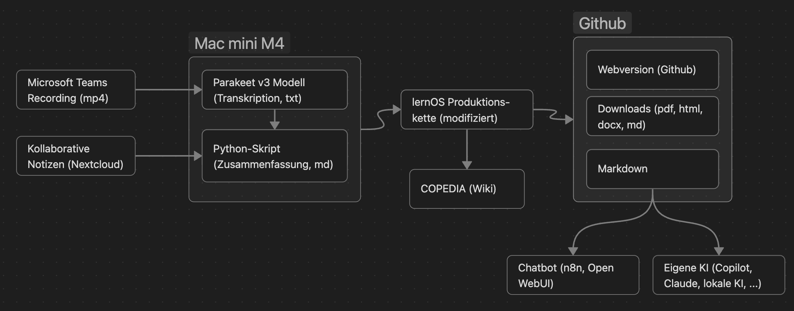

# Dokumentation

Bei der loscon werden wir wieder unseren bewährten Ansatz der **KI-gestützten Veranstaltungsdokumentation** verwenden. Die Aufzeichnungen der Programmpunkte werden automatisch transkripiert, zusammengefasst und zur zum **loscon26 Unkonferenzband** zusammengestellt. Natürlich werdet ihr im Nachgang mit der Dokumentation auch über einen **Chatbot** "reden" können. Die gesamte Dokumentation wird im Nachgang unter [Loscon26 – Copedia](https://wiki.cogneon.de/loscon26) zugreifbar sein.

## Workflow KI-basierte Dokumentation

Das folgende Bild zeigt schematisch den **Workflow** der automatischen Erstellung der Dokumentation:

Für die **Zusammenfassung der Inhalte** wollen wir dieses Jahr verschiedene **Large Language Modell (LLM)** verwenden:

- **Claude Sonnet 4.6** als Referenz für die Qualität

- **OpenAI GPT OSS 120B** mit Inferenz auf dem [Ionos AI Hub](https://cloud.ionos.de/managed/ai-model-hub) in Deutschland

- **Alibaba Qwen3.5 9B** über [Openrouter](https://openrouter.ai) als "Proof of Concept" mit einem Modell, das auch auf einem Laptop laufen kann.