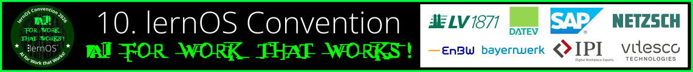
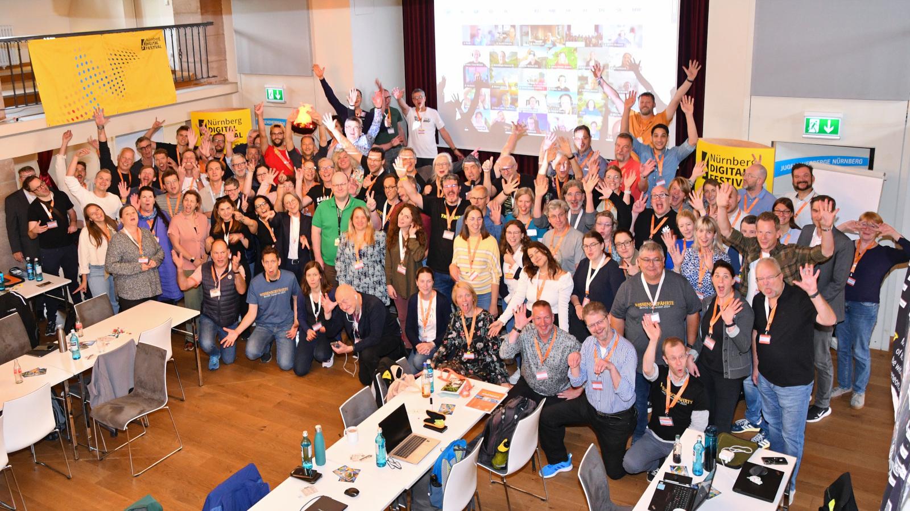

# Willkommen zur lernOS Convention 2026 💚

Vom **23.-24. Juni 2026** findet die **10. lernOS Convention** ([#loscon26](https://cogneon.github.io/mastowall/?hashtags=loscon26%2Clernos&server=https%3A%2F%2Fcolearn.social)) auf der [Kaiserburg Nürnberg](location.md), in [dezentralen Lokationen](loscon-everywhere.md) und [Online](hmk.md) statt. Das **Community-Event** zu **Wissensmanagement** & **Lernenden Organisationen** steht dieses Mal unter dem **Motto „AI for Work that Works!“**. Auf den **Infoseiten** hier unter [loscon.lernos.org](https://loscon.lernos.org) findet ihr alle Infos.

Du kennst **lernOS** noch gar nicht? 
Mit **lernOS** lernst Du gemeinsam statt allein: flexibel, strukturiert und im Austausch mit Deiner Lerngruppe und Community. Lernpfade, Wochencalls und gegenseitiger Support helfen Dir, dranzubleiben und neue Perspektiven zu gewinnen. Die Community lebt von Offenheit, Wissensaustausch und aktiver Mitgestaltung.
**lernOS** arbeitet agil mit adaptiven Lernzielen in 3-Monats-Sprints und fördert so systematisches Wissensmanagement und lebenslanges Lernen. Die **lernOS Community** entwickelt das Konzept kontinuierlich weiter – und trifft sich jährlich auf der **lernOS Convention**, der **loscon**.

<button type="button" style="background-color: #00FF41; color: white;"><a href="https://pretix.eu/cogneon/loscon26/" target="_blank">Tickets</a></button> <button type="button" style="background-color: #00FF41; color: white;"><a href="https://loscon.lernos.org/de/program/">Programm</a></button> <button type="button" style="background-color: #00FF41; color: white;"><a href="https://loscon26.myspreadshop.de/all" target="_blank">Merch</a></button> <button type="button" style="background-color: #00FF41; color: white;"><a href="https://flow.cogneon.io/webhook/f56199f0-dfa6-42a1-95b5-673d08e2c458/chat" target="_blank">Chatbot</a></button>

<a href="https://logwork.com/countdown-timer" class="countdown-timer" data-timezone="Europe/Berlin" data-language="de" data-date="2026-06-23 13:00">&nbsp;</a>

## Wichtige Termine

- ✅ **02.03.:** Golive [Landing Page](https://cogneon.de/loscon26), [Ticket-Shop](https://pretix.eu/cogneon/loscon26/) und Versand Einladung an loscon-Alumni
- ✅ **16.03.:** Golive [Call for Participation](https://pretalx.com/loscon26/cfp) (Einreichung Programmvorschlägen bis Ende April)
- ✅ **11.05.:** [Programm](program.md) Version 1.0 ist fertig 🎉
- **31.05.:** Ende des [AI Crowdsourcing 2026](ai-crowdsourcing.md)
- **17.06.:** [Vorab-Webkonferenz](pre-call.md) (13:05 - 13:55 Uhr)
- **22.06.:** [Vorabend-Treffen](eve.md) bei der Eröffnung des [Nürnberg Digital Festivals](https://nuernberg.digital)
- **23.-24.06.:** [lernOS Convention 2026](program.md) 🚀

## News

<iframe allowfullscreen sandbox="allow-top-navigation allow-scripts allow-popups allow-popups-to-escape-sandbox" style="max-width:100vw;max-height:100vh;" width="600" height="800" src="https://www.mastofeed.com/apiv2/feed?userurl=https%3A%2F%2Fcolearn.social%2Fusers%2Flernos&theme=light&size=100&header=false&replies=false&boosts=false"></iframe>
