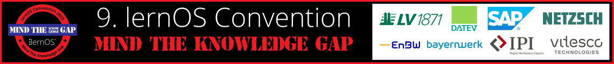

# Willkommen zur lernOS Convention 2026 💚

Die **10. lernOS Convention** ([#loscon26](https://cogneon.github.io/mastowall/?hashtags=loscon26,loscon25,lernos&server=https://colearn.social)) findet vom **23.-24. Juni 2026** auf der **Kaiserburg Nürnberg**, in **dezentralen Satelliten** & **Online** statt (hybride Veranstaltung). Das Motto ist **"AI for Work that Works!"**.

Die **lernOS Convention** ist das Top-Event zu **Wissensmanagement** und **Lernenden Organisationen** im deutschsprachigen Raum. Der digitale Arbeitsplatz, moderne Intranets, New Ways of Working und persönliches Wissensmanagement für Wissensarbeiter:innen und Lernende Teams sind die zentralen Themen.

<a href="https://logwork.com/countdown-timer" class="countdown-timer" data-timezone="Europe/Berlin" data-language="de" data-date="2026-06-23 13:00">loscon26 Countdown</a>

Auf diesen **Infoseiten** findet ihr alle Informationen zur Veranstaltung. Die **Tickets** für Vor-Ort- und Online-Teilnahme sind [über den Ticketshop](https://pretix.eu/cogneon/loscon26/) verfügbar.

<button type="button"><a href="https://pretalx.com/loscon25/schedule/" target="_blank">Programm</a></button> <button type="button"><a href="https://cogneon.de/event/lernos-convention-2025/" target="_blank">Landing Page</a></button> <button type="button"><a href="https://pretix.eu/cogneon/loscon25/" target="_blank">Tickets</a></button> <button type="button"><a href="https://cogneon.de/2025/03/02/mind-the-knowledge-gap-das-motto-der-lernos-convention-2025/" target="_blank">Blog zum Leitthema</a></button>

## Wichtige Termine

- **06.02.:** Start der Orga-Calls des [Orga-Teams](orga-team.md) (jeweils Freitags, 09:00 - 10:00 Uhr)
- **10.03.:** Golive Landing Page [cogneon.de/loscon26](https://cogneon.de/loscon26) und [Ticketshop](https://pretix.eu/cogneon/loscon25/) und Versand Einladung an loscon-Alumni
- **24.03.:** Golive [Call for Participation](https://pretalx.com/loscon25/cfp) (CfP, Einreichung von Programmvorschlägen bis 23.05. um 23:59 Uhr)
- **02.06.:** [Programm](https://pretalx.com/loscon25/schedule/) Version 1.0 ist fertig 🎉
- **16.06.:** Versand der [Future-Backwards-Anleitung](https://loscon.lernos.org/de/gap-closer/) und Einladung aller Teilnehmer:innen in den Discord-Server der loscon
- **18.06.:** Vorab-Webkonferenz (13:00 - 14:00 Uhr), im Anschluss ist von 14:00-15:00 Uhr Zeit zum betreuten Testen der Infrastruktur
- **22.06.:** Aufbau in der Burg (voraussichtlich ab Mittag)
- **22.06.:** [Vorabend-Treffen](eve.md) bei der Eröffnungsveranstaltung des [Nürnberg Digital Festivals](https://nuernberg.digital) im [Künstlerhaus am Hauptbahnhof](https://www.kunstkulturquartier.de/kuenstlerhaus) (kostenlose Anmeldung notwendig)
- **23.-24.06.:** [lernOS Convention 2025](https://cogneon.de/loscon25)
- **11.07.:** loscon-Retro des [Orga-Teams](orga-team.md) (09:00 - 10:00 Uhr)

## Eindrücke von früheren lernOS Conventions

<iframe width="560" height="315" src="https://www.youtube-nocookie.com/embed/W0UaN3bcmXc?si=ObdDokULBMWcYWjI" title="YouTube video player" frameborder="0" allow="accelerometer; autoplay; clipboard-write; encrypted-media; gyroscope; picture-in-picture; web-share" referrerpolicy="strict-origin-when-cross-origin" allowfullscreen></iframe>
