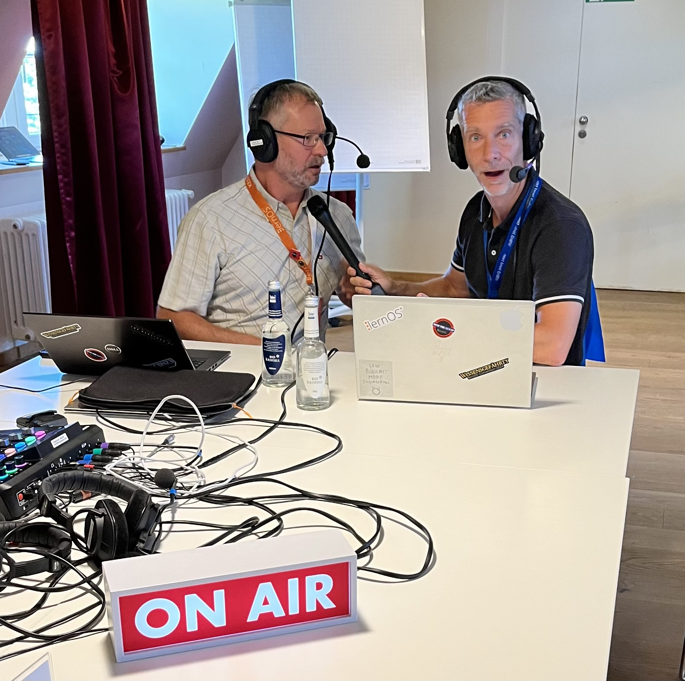

# Podcast-Tisch

Auf der lernOS Convention gibt es einen **Podcast-Tisch**, an dem ihr euch über Podcasting informieren (s.a. [lernOS Podcast Leitfaden](https://cogneon.github.io/lernos-podcasting/de/)) und **eigene Podcasts aufnehmen** könnt. Die Technik am Podcast-Tisch wird von einem Audio Buddy, d.h. ihr müsst euch nicht kümmern. Die Aufnahmen werden mit den Aufzeichnungen der lernOS Convention veröffentlicht. "enn ihr ein Speichermedium mitbringt, könnt ihr die Aufnahmen z.B. für eigene Podcasts direkt mitnehmen.

**Hinweis:** Das Programm am Podcast-Tisch ist in das [Programm](program.md) integriert, Vorschläge für Podcast-Sessions können **über den Call for Participation** eingereicht werden.

## Technik Podcast-Tisch

1. Audio-Mixer/-Interface [RodeCaster Pro II](https://rode.com/de/interfaces-and-mixers/rodecaster-series/rodecaster-pro-ii)
2. 4x [Beyerdynamic DT297 Headsets](https://www.beyerdynamic.de/dt-297.html)
3. 1x PC für Discord-Einwahl und Einbindung von Remote-Personen
4. 1x PC mit [Reaper](https://www.reaper.fm/), [Ultraschall](https://ultraschall.fm) und [Studio Link](https://studio-link.de/) für die Multitrack-Aufnahme des Podcasts (alle Sprecher:innen aus Discord sind auf einer Spur)
5. 1x Lautsprecher für das Live-Podcasting (damit die Leute vor Ort etwas hören)